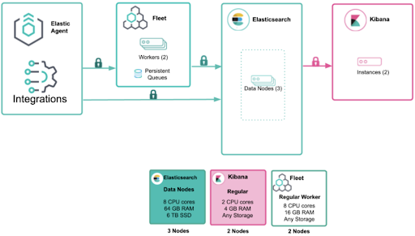

# Elastic Stack Installation Guide

This repository contains instructions and configuration files for installing and setting up the **Elastic Stack**, which includes:

- **Elasticsearch**: A distributed search and analytics engine.
- **Kibana**: A visualization and exploration tool for Elasticsearch data.
- **Logstash**: A data processing pipeline that ingests, transforms, and sends data to Elasticsearch.
- **Fleet**: An agent management system for collecting and monitoring data across multiple sources.
- **Filebeat**: A lightweight shipper for forwarding and centralizing log data.

## Prerequisites

- A server or set of servers running **Linux** (Ubuntu, CentOS, or similar).
- **Java** (for Logstash) installed on the system.
- **Root or Sudo Access** for installation.
- Minimum recommended system resources:
  - **Memory**: 4 GB RAM (Elasticsearch can require more for larger datasets)
  - **Storage**: At least 20 GB of free disk space
  - **CPU**: Multi-core processors recommended for Elasticsearch.

---

## Installation Overview

1. [Elasticsearch](#1-install-elasticsearch)
2. [Kibana](#2-install-kibana)
3. [Logstash](#3-install-logstash)
4. [Fleet](#4-install-fleet)
5. [Filebeat](#5-install-filebeat)

